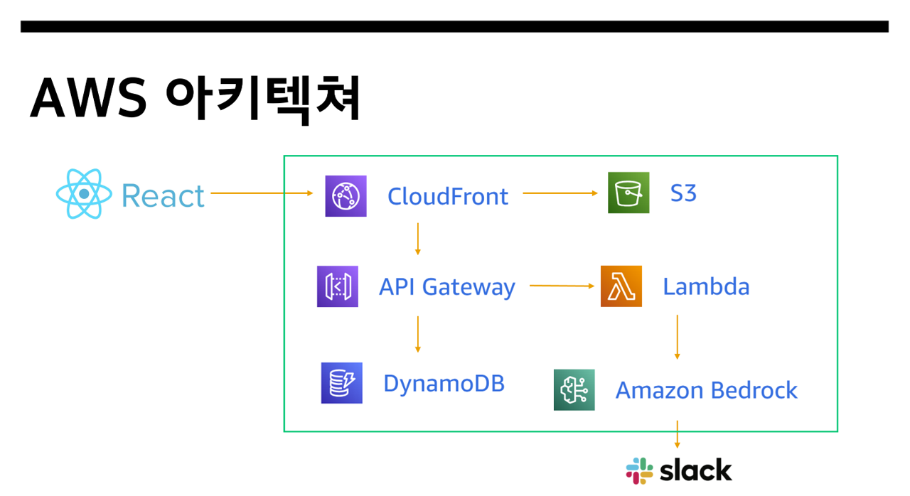

# GMP CheckMaster AI : 제약업계 지능형 체크리스트 관리 시스템

GMP CheckMaster AI는 제약 제조업체가 직면한 실제 현장 문제들을 AI 기술로 해결하는 혁신적인 시스템입니다. 

**현장의 실제 Pain Point들:**
- **수기 체크리스트의 한계**: 방진복 착용 후 손소독을 완료한 상태에서는 종이 체크리스트 작성이 어려워 형식적으로 진행되는 문제
- **주관적 육안 검사**: 작업자 상처나 피부 이상을 일관성 있게 판단하기 어려운 현실적 한계
- **오래된 장비 인터페이스**: 공조기, PLC 장비 등의 아날로그 계기를 디지털화하는 비용 부담
- **실시간 모니터링 부재**: 문제 발생 시 즉시 대응할 수 있는 알림 체계 부족

**Q Developer와 함께 도출한 해결책:**
이러한 현장 문제들을 분석한 Q Developer는 해커톤 환경에 적합하면서도 실용적인 **AI 기반 체크리스트 시스템**을 제안했습니다. Amazon Bedrock Claude Vision을 활용한 상처 자동 분석, 터치 기반 디지털 체크리스트, QR 코드 출입 관리, 그리고 Slack 실시간 알림 시스템을 통해 GMP 규정 준수의 효율성과 정확성을 동시에 확보합니다.

향후 공조기 AI 인식, PLC 장비 연동 등으로 확장 가능한 기반을 마련하여, 제약업계 전반의 디지털 전환을 지원하는 종합 솔루션으로 발전시킬 수 있습니다.

## 어플리케이션 개요

GMP CheckMaster AI는 제약업계의 현실적인 GMP(Good Manufacturing Practice) 준수 이슈를 해결하기 위한 AI 기반 솔루션입니다. 수기로 기록되던 체크리스트들을 방진복 착용, 손소독 등 이후 체크하기 어려운 문제를 AI 기술로 해결하고, 공조기와 오래된 PLC 장비 인터페이스의 비용 이슈를 AI 인식으로 보완합니다. Q Developer의 제안으로 해커톤에 적합한 체크리스트 중심의 시스템을 구현하여 실용적이고 확장 가능한 GMP 준수 솔루션을 제공합니다.

## 주요 기능

- **AI 기반 상처 분석**: Amazon Bedrock Claude-3 Sonnet Vision 모델을 활용하여 작업자의 상처, 화상, 멍 등을 자동으로 감지하고 심각도를 평가합니다. 카메라 촬영 또는 파일 업로드를 통해 실시간 분석이 가능합니다.

- **지능형 체크리스트**: 7개 핵심 건강상태 항목(발열, 기침, 설사, 구토, 피부질환, 상처, 약물복용)을 체계적으로 확인하고, AI 분석 결과와 종합하여 최종 출입 허가 여부를 결정합니다.

- **QR 코드 출입 관리**: 체크리스트 완료 후 개인별 QR 코드를 생성하여 출입 허가/불허 상태를 시각적으로 표시합니다. 관리자는 QR 스캐너를 통해 실시간으로 출입 자격을 검증할 수 있습니다.

- **실시간 알림 시스템**: 심각한 상처나 건강 이상이 감지될 경우 Slack 웹훅을 통해 관리자에게 즉시 알림을 전송하여 신속한 의료 조치가 가능합니다.

## 동영상 데모


## 리소스 배포하기

### 1. 사전 요구 사항
- AWS CLI 설치 및 구성
- Terraform 설치 (>= 1.0)
- Node.js 및 npm 설치
- 적절한 AWS 권한 (Lambda, API Gateway, DynamoDB, S3, CloudFront, Bedrock 관리 권한)

### 2. 백엔드 인프라 배포

```bash
# 인프라 디렉토리로 이동
cd development/infrastructure

# Terraform 초기화
terraform init

# 실행 계획 확인
terraform plan

# 인프라 생성
terraform apply
```

### 3. 프론트엔드 배포

```bash
# 프론트엔드 디렉토리로 이동
cd development/frontend/gmp-app

# 의존성 설치
npm install

# 프로덕션 빌드
npm run build

# S3에 배포
aws s3 sync dist/ s3://drug-qrew --region us-east-1 --delete

# CloudFront 캐시 무효화
aws cloudfront create-invalidation --distribution-id E2SD4VARUZNJTA --paths "/*" --region us-east-1
```

### 4. 자동 처리 과정

Terraform 실행 시 다음이 자동으로 처리됩니다:
1. AWS Lambda 함수들 생성 (인증, 체크리스트, AI 분석, QR 생성)
2. API Gateway 및 DynamoDB 테이블 생성
3. S3 버킷 및 CloudFront 배포 설정
4. IAM 역할 및 정책 자동 구성

### 5. 출력 값 및 AWS 아키텍처

배포 완료 후 다음 정보들이 제공됩니다:

- **웹사이트 URL**: https://d2u50nn4x8zei8.cloudfront.net
- **API 엔드포인트**: https://2c0irfuzji.execute-api.us-east-1.amazonaws.com/Prod
- **S3 버킷**: drug-qrew

### AWS 아키텍처

- **Frontend**: React 앱을 S3 정적 웹 호스팅 + CloudFront CDN
- **Backend**: API Gateway + Lambda 함수들
- **Database**: DynamoDB (사용자, 체크리스트, 결과 저장)
- **AI**: Amazon Bedrock Claude-3 Sonnet Vision
- **알림**: Slack Webhook 연동

### 6. 리소스 정리

인프라를 삭제하려면:

```bash
# S3 버킷 비우기
aws s3 rm s3://drug-qrew --recursive

# Terraform으로 리소스 삭제
cd development/infrastructure
terraform destroy
```

## 사용 방법

### 작업자 플로우
1. **https://d2u50nn4x8zei8.cloudfront.net** 접속
2. **사번 입력** (EMP001: 김철수, EMP002: 이영희, EMP003: 박민수, EMP004: 정수연)
3. **7개 항목 체크리스트** 작성
4. **AI 상처 분석** (카메라 촬영 또는 파일 업로드)
5. **QR 코드 확인** (출입 허가/불허 결과)

### 관리자 플로우
1. **관리자 로그인** (ADMIN001)
2. **QR 스캐너** 실행
3. **작업자 QR 코드 스캔**으로 출입 허가 검증

## 프로젝트 기대 효과 및 예상 사용 사례

### 1. 기대 효과
- **객관적 건강 판정**: AI 기반 상처 분석으로 주관적 판단 오류 제거
- **실시간 모니터링**: 즉시 알림 시스템으로 신속한 의료 대응 가능
- **규정 준수 강화**: 체계적인 기록 관리로 GMP 감사 대응력 향상
- **업무 효율성**: 자동화된 체크리스트로 관리자 업무 부담 경감

### 2. 예상 사용 사례
- **제약 제조업체**: 청정실 출입 관리 및 GMP 규정 준수
- **식품 가공업체**: HACCP 기준에 따른 작업자 건강 관리
- **의료기기 제조**: 무균 환경 출입 통제 시스템
- **화학 공장**: 안전 규정 준수를 위한 작업자 상태 점검
- **연구소**: 실험실 안전 관리 및 오염 방지

## 팀 정보
- **팀명**: drug qrew
- **팀원**: 백승재 (SAP 개발자), 풍기덕 (SAP 운영자)
- **소속**: 일동제약 IT 부서
- **해커톤**: AWS 해커톤 2025.09.05-06
